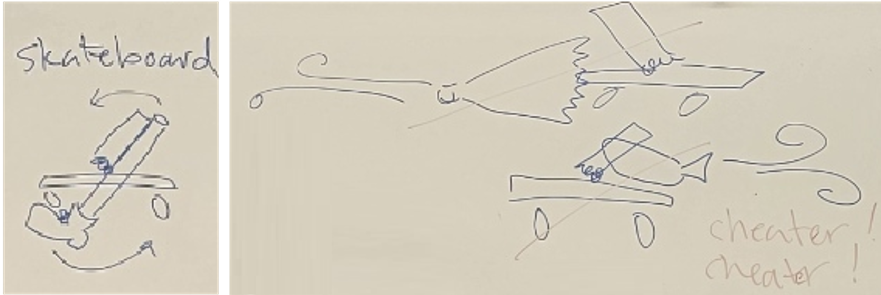
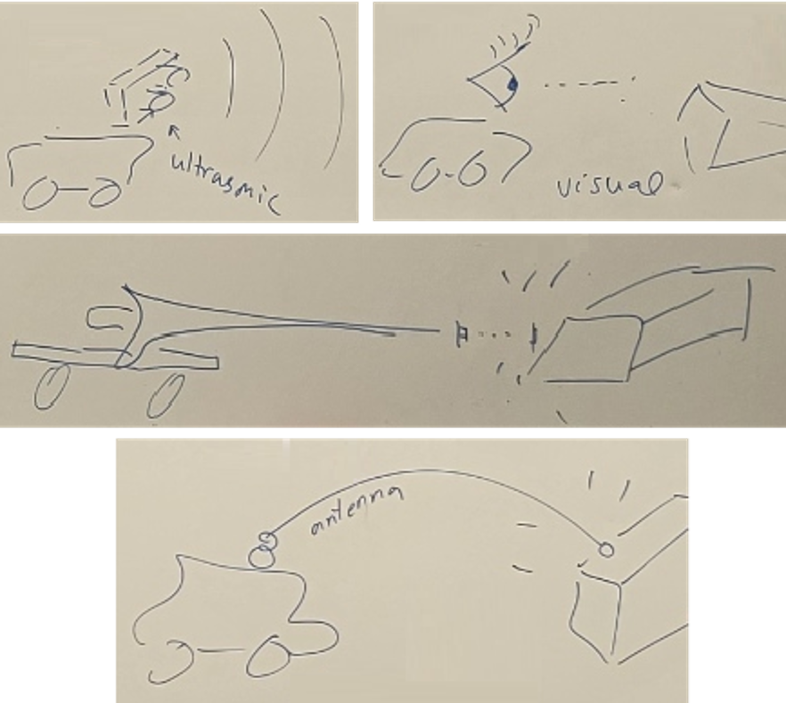
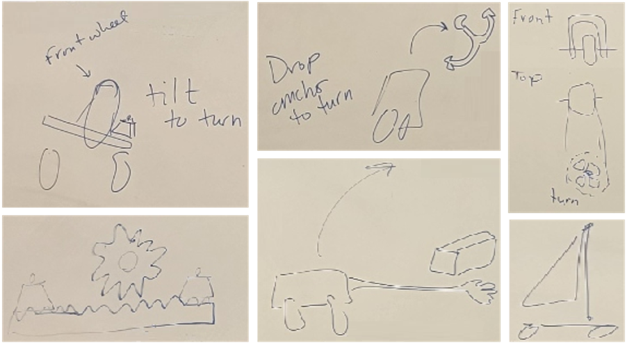
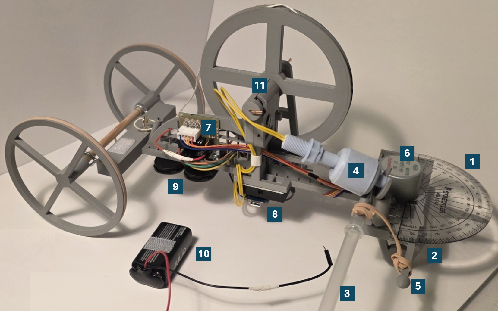
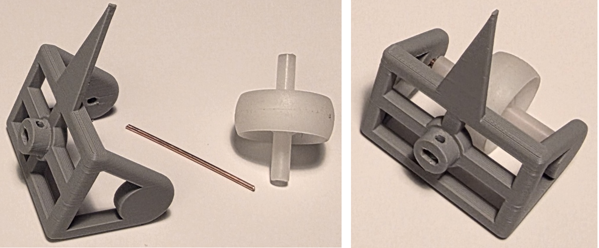
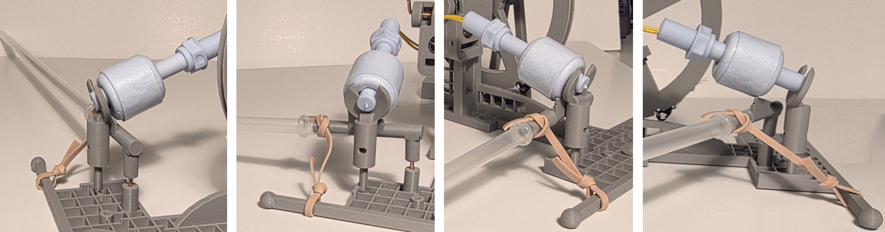
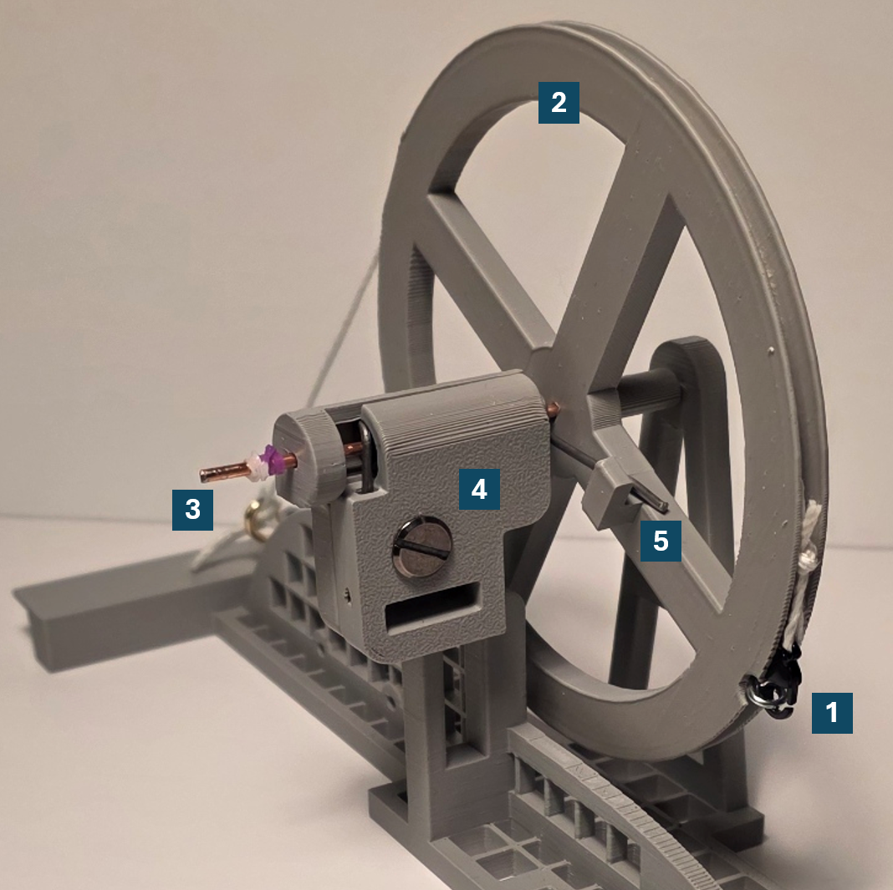
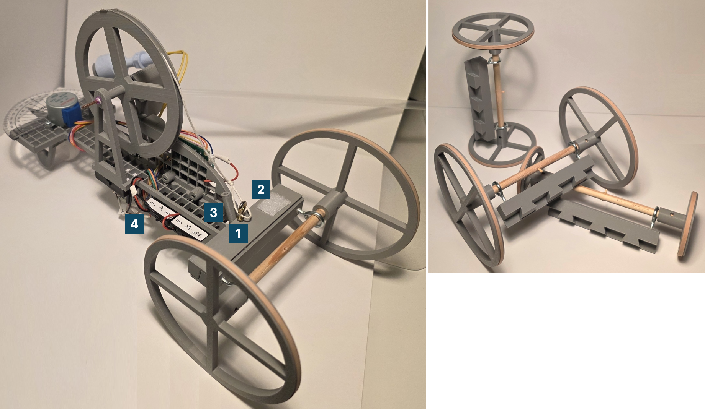
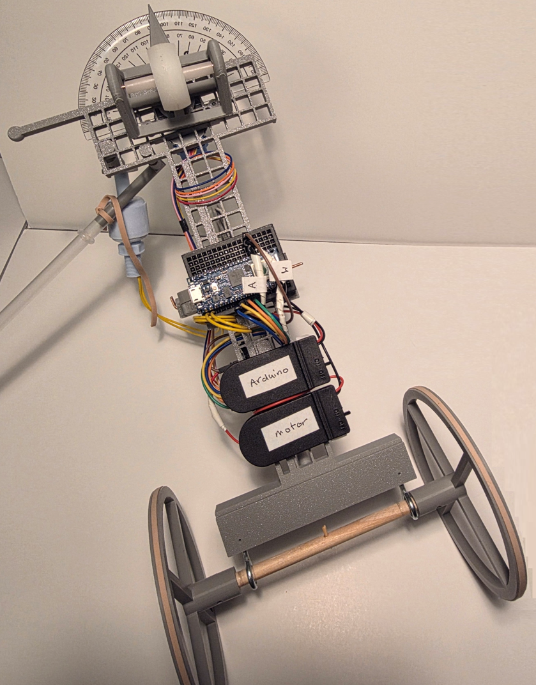

# Mousetrap Car
Group project for: **ENG8001 - Principles of Design**, [Bachelor of Engineering (Automation and Robotics Engineering) (Co-op)](https://www.algonquincollege.com/sat/program/bachelor-of-automation-and-robotics/)

&nbsp;

## Background

### Mousetrap cars in STEM education
Sooner or later, most science, engineering, or design students build a [mousetrap car](https://en.wikipedia.org/wiki/Mousetrap_car). :)

Details vary, but most projects focus on building a small car that is powered by a spring-loaded bar type of mousetrap. Mousetrap car builders sometimes compete to see who can build a car that achieves maximum speed or maximum distance.

### Our project goals
1. Build a mousetrap car that travels 20 feet as efficiently as possible while autonomously navigating around an 8-inch x 4-inch obstacle at a variable distance in the center of a 4-foot-wide track.
2. Learn to apply engineering design principles and practices.

&nbsp;

## Design conception

### Objectives
We identified 5 objectives:
1. Go fast – Be in the top 25% fastest results
2. Sense object – Detect object 100% of the time
3. Avoid object – Avoid the object 100% of the time
4. Stay on the track/cross the finish – Even if we are not the fastest, complete the course every run
5. Consistent performance – Successfully detect and avoid the object every run; and the time of our runs will not vary by more than 10%

To prioritize these objectives, we used a pairwise comparison matrix.  For each cell, a 1 is assigned if the objective in that row is more important than the objective in that column.  Then, for each row, the sum of the 1's is the score for the objective in that row.

Table 1: Pairwise comparison of objectives
<table>
<tr>
<td>&nbsp;</td>
<td align="center">Go fast</td>
<td align="center">Sense object</td>
<td align="center">Avoid object</td>
<td align="center">Stay on track</td>
<td align="center">Consistent</td>
<td align="center"><b>Score</b></td>
</tr>
<tr>
<td>Go fast</td>
<td align="center">x</td>
<td align="center">0</td>
<td align="center">0</td>
<td align="center">0</td>
<td align="center">1</td>
<td align="center"><b>1</b></td>
</tr>
<tr>
<td>Sense object</td>
<td align="center">1</td>
<td align="center">x</td>
<td align="center">0</td>
<td align="center">0</td>
<td align="center">1</td>
<td align="center"><b>2</b></td>
</tr>
<tr>
<td>Avoid object</td>
<td align="center">1</td>
<td align="center">1</td>
<td align="center">x</td>
<td align="center">1</td>
<td align="center">1</td>
<td align="center"><b>4</b></td>
</tr>
<tr>
<td>Stay on track</td>
<td align="center">1</td>
<td align="center">1</td>
<td align="center">0</td>
<td align="center">x</td>
<td align="center">1</td>
<td align="center"><b>3</b></td>
</tr>
<tr>
<td>Consistent</td>
<td align="center">0</td>
<td align="center">0</td>
<td align="center">0</td>
<td align="center">0</td>
<td align="center">x</td>
<td align="center"><b>0</b></td>
</tr>
</table>

### Key functions
We identified key functions:
1. How is power transferred from the spring to the wheels?
2. How is the object sensed?
3. How is the object avoided?
4. How is steering accomplished?
5. How will the car stay on the track?
6. How will speed be optimized?

We used a morphological table to define the space of our early conceptual solutions.

Table 2: Morphological table
<table>
<tr>
<td align="center"><b>Function</b></td>
<td  align="center" colspan="3"><b>Means</b></td>
</tr>
<tr>
<td valign="top">Transfer power from spring</td>
<td valign="top">Tie a string from the hammer to around the axle</td>
<td valign="top">Attach an extension to the hammer and tie the string to that for greater leverage</td>
<td valign="top">Attach a "foot" to the hammer so that when the spring unwinds, the foot pushes against the ground</td>
</tr>
<tr>
<td valign="top">Sense object</td>
<td valign="top">Ultrasonic sensor</td>
<td valign="top">Camera</td>
<td valign="top">"Feeler" (like antennae or whiskers)</td>
</tr>
<tr>
<td valign="top">Avoid object</td>
<td valign="top">Steer around the object</td>
<td valign="top">Jump over the object</td>
<td valign="top">Use the object itself to push the car around (like a spinning bumper)</td>
</tr>
<tr>
<td valign="top">Stay on Track</td>
<td valign="top">Detect the tape at the edges using a camera and steer away from them</td>
<td valign="top">Steer a trajectory that passes close to the object (because it’s in the middle)</td>
<td valign="top">Programmatically limit steering to maintain an overall straight displacement</td>
</tr>
<tr>
<td valign="top">Steering</td>
<td valign="top">Use a motor to pivot the front axle</td>
<td valign="top">Use a weight to lean to turn the wheels (like a skateboard)</td>
<td valign="top">Temporarily drop an anchor to pull the car to the left or right</td>
</tr>
<tr>
<td valign="top">Speed</td>
<td valign="top">Use 3 wheels instead of 4 to reduce friction from wheels</td>
<td valign="top">Make the car aerodynamic</td>
<td valign="top">Start the car on an angle to reduce the number of turns needed</td>
</tr>
</table>

### Sketches
Whiteboard sketches from brainstorming concepts:

 
Figure 1: Sketches of ways to transfer energy from the spring into motion. Left: Attachment to spring pushes on the ground (like a person on a skateboard.)  Right: Squashing air from a bellows or whoopee cushion – deemed not allowed.

 
Figure 2: Sketches of ways to sense the object.  Top left: ultrasonic sensor.  Top right: camera.  Middle: Touching the object with a rigid, forward extension (like a lance.)  Bottom: Feelers (like whiskers or antennae.)

 
Figure 3: Sketches of ways to steer.  Top left: tilt the vehicle (like a bicycle or skateboard.) Bottom left: method of tilting. Top middle: touch the ground and pivot.  Bottom middle: pivot around the wood block.  Top right: turn the wheel with a motor.  Bottom right: use a sail like a rudder to turn.

&nbsp;

## Testing
We developed a set of parameters for our selected concepts and a reasonable set of levels for each parameter:
- **Drive wheel diameter** – How large is just right for our situation? Levels (3): 50mm, 75mm, 100mm
- **Axle grip** – How to decrease the slipping of the string on the driving axle? Levels (3): bare wood, axle with grippy substance, hook on the axle
- **Hammer arm vs. wheel** – Is there a benefit to allowing the spring to turn more than 180°? Levels (2): Regular mousetrap with an arm attached to the hammer, spring with no wood and a wheel attached to the hammer
- **Hammer arm/wheel size** – How large is just right for our situation. Levels (3): 50mm, 100mm, 150mm
- **Powertrain layout** – Is front-wheel drive or rear-wheel drive faster? Levels (2): front-wheel drive, rear-wheel drive
- **Object detection method** – How to detect the obstacle? Levels (3): whisker sensor, ultrasonic sensor, camera
- **Steering method** – How to steer? Levels (2): motor turn directly, lean to turn

Table 3: Parameters and levels
<table>
<tr>
<td colspan="2">&nbsp;</td>
<td><b>1</b></td>
<td><b>2</b></td>
<td><b>3</b></td>
</tr>
<tr>
<td><b>A</b></td>
<td>Drive wheel diameter (mm)</td>
<td>50</td>
<td>75</td>
<td>100</td>
</tr>
<tr>
<td><b>B</b></td>
<td>Axle grip</td>
<td>Bare wood</td>
<td>Axle with grippy substance applied</td>
<td>Hook on the axle</td>
</tr>
<tr>
<td><b>C</b></td>
<td>Hammer arm vs. wheel</td>
<td>Arm</td>
<td>Wheel</td>
<td>x</td>
</tr>
<tr>
<td><b>D</b></td>
<td>Hammer arm/wheel size (mm)</td>
<td>50</td>
<td>100</td>
<td>150</td>
</tr>
<tr>
<td><b>E</b></td>
<td>Powertrain layout</td>
<td>Front</td>
<td>Rear</td>
<td>x</td>
</tr>
<tr>
<td><b>F</b></td>
<td>Object detection</td>
<td>Whisker</td>
<td>Ultrasonic</td>
<td>Camera</td>
</tr>
<tr>
<td><b>G</b></td>
<td>Steering</td>
<td>Motor turn</td>
<td>Lean</td>
<td>x</td>
</tr>
</table>

To perform full factorial testing with 7 factors and up to 3 levels would require on the order of (levels)(factors) : 37 = 2187 tests. That’s a lot of tests to run! So, we used a [Taguchi orthogonal matrix](https://www.york.ac.uk/depts/maths/tables/orthogonal.htm) to reduce the number of tests to run.

Unfortunately, there is no 7-factor, mixed-level Taguchi orthogonal matrix available to copy. So, we wrote a [Python script](https://github.com/spackows/Mousetrap-Car_ENG8001/blob/main/code-snippets/Adjust-Taguchi-matrix_2025-11-06.py) to convert a 13-factor, 3-level Taguchi orthogonal matrix (27 rows) for our purposes.

&nbsp;

## Final design 

 
Figure 4: Side view

1. Our strategy was to aim our car just to the left of the object from the start line so that the car only had to make one right turn after passing the object.  We attached a protractor to ensure our front wheel was perfectly aimed.
2. Our car had one front wheel; and the whole axle pivoted to turn.  *See Figure 5 for details.*
3. A plastic straw acted as our whisker to detect the obstacle.  *See Figure 6 for multiple views.*
4. When the car passed close by the obstacle, the whisker was pushed backwards on the car by the obstacle, raising the float sensor, signalling to turn right after a short delay.  (Calculating how much to turn the wheel was based on a real-time measurement of how long the car had been traveling since being released at the start line.)
5. The whisker was attached to a post with an elastic to prevent the whisker from falling back due to the car's acceleration at the start.
6. The front axle was turned by a [28BYJ-48 stepper motor](https://www.makerguides.com/wp-content/uploads/2019/04/28byj48-Stepper-Motor-Datasheet.pdf).
7. The driver board for the stepper motor was screwed to the chassis in a way that made accessing the pins easy.
8. An [Arduino Nano 33 IoT](https://docs.arduino.cc/hardware/nano-33-iot/) was attached to the bottom of the chassis in a way that made attaching a micro-USB cable easy.
9. One pair of 3V button cell batteries powered the stepper motor and one pair powered the Arduino.
10. The button cell batteries were chosen for their light weight.  But they lost power after only a few runs.  So, during testing, we temporarily attached a 9V battery.
11. We removed the spring from the mousetrap and used it to turn a wheel that pulled a string wrapped around the rear axle. *See Figure 7 for details.*

 
Figure 5: Front axle and wheel

 
Figure 6: Views of the whisker

 
Figure 7: Spring tower

We reasoned that because the mousetrap snaps shut with great force, there must be unused energy in the spring when only turned through 180°. Removing the spring from the wooden board of the trap and encasing it in the spring tower made it possible to get more energy from the spring - through nearly 360°.

1. String wrapped around the rear axle was draped around the circumference of a large drive wheel.
2. The drive wheel was powered by the mousetrap spring.
3. The drive wheel and mousetrap spring were mounted in a central axle.
4. The spring was held securely in place by a specially designed housing that made it easy to replace the spring after one or two uses (when the spring lost its springiness).
5. One arm of the spring hooked onto the drive wheel, and the drive wheel was manually rotated to load the spring before releasing the car at the start of the track.

 
Figure 8: Read view

1. The rear axle and wheels were detachable to make it easier to transport the car to and from class and to make it easier to test different wheel sizes.
2. The 9V battery was temporarily attached to the car by velcro during testing.
3. Because aiming the car just to the left of the obstacle was a critical part of our strategy, a long bamboo stick (a shish kabob stick) could be secured in a holder. This enabled us to visually align the nose of the car with the stick for better aim.
4. The button cell battery holders had on-off switches so we could save the power in the batteries.  The holders were labelled with stickers to make it easy to know which batteries powered which part of the solution.

 
Figure 9: With the shish kabob stick removed, the chassis could sit upside down for easy access to wiring, batteries, and the Arduino.  The battery holder and wires were labelled on the bottom too.

&nbsp;

## Discussion
Our team designed a solution that met the given basic requirements.  Our car made the distance and successfully detected and avoided the obstacle.  

However, we also leaned into exploring quirky solutions, such as aiming the car just to the left of the obstacle, sensing the obstacle by touch, and getting more energy from the spring by removing it from the mousetrap board.  

In addition, we spent considerable effort designing a solution that was modular, to make it easy to transport and to switch components during iterative development.  

Finally, a significant focus of our design was ease of maintenance: designing the chassis to sit upside down; carefully positioning the batteries, stepper motor driver board, and Arduino for easy access; and labeling components and wires.

Children can have fun building mousetrap cars.  Of course, requiring that the car autonomously sense and avoid an obstacle increased the technical challenge.  But a mousetrap car project can also be used to learn how to apply rigorous engineering design practices, such as: objectives prioritization through pairwise comparison; systematic exploration of conceptual solutions through the use or morphological tables; test plan creation, including the use of Taguchi orthogonal matrices to reduce the number of tests while still covering required functionality; and writing formal reports at different stages of design and development.

&nbsp;

