<table>
<tr>
<th>Thumbnail</th>
<th>File and description</th>
</tr>
<!---------------------------------- Small drive wheel -->
<tr>
<td valign="top">

</td>
<td valign="top">

<a href="drive-wheel-050_2025-11-12_01.SLDPRT">drive-wheel-050_2025-11-12_01</a>

Small drive wheel (wheel attached to axle being driven by spring)

</td>
</tr>
<!---------------------------------- Medium drive wheel -->
<tr>
<td valign="top">
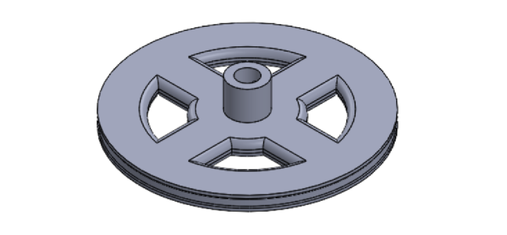
</td>
<td valign="top">

<a href="drive-wheel-075_2025-10-26_01.SLDPRT">drive-wheel-075_2025-10-26_01</a>

Medium drive wheel (wheel attached to axle being driven by spring)

</td>
</tr>
<!---------------------------------- Large drive wheel -->
<tr>
<td valign="top">
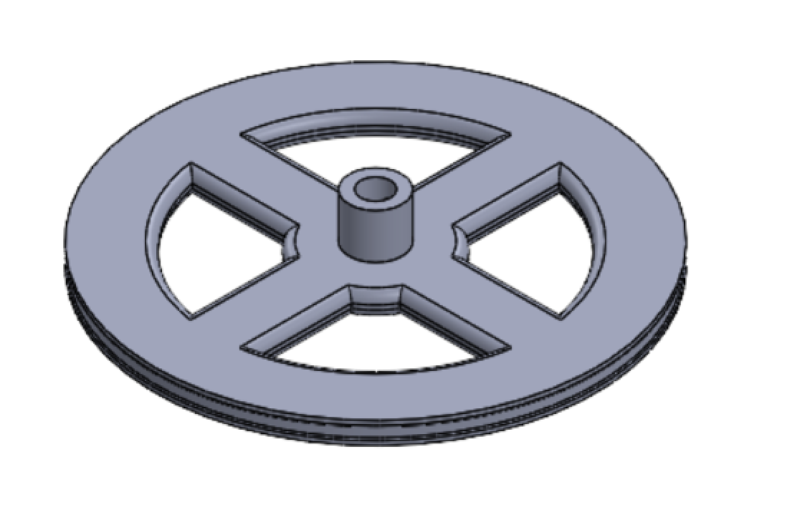
</td>
<td valign="top">

<a href="drive-wheel-100_2025-10-26_01.SLDPRT">drive-wheel-100_2025-10-26_01</a>

Large drive wheel (wheel attached to axle being driven by spring)

</td>
</tr>
<!---------------------------------- Third wheel holder -->
<tr>
<td valign="top">
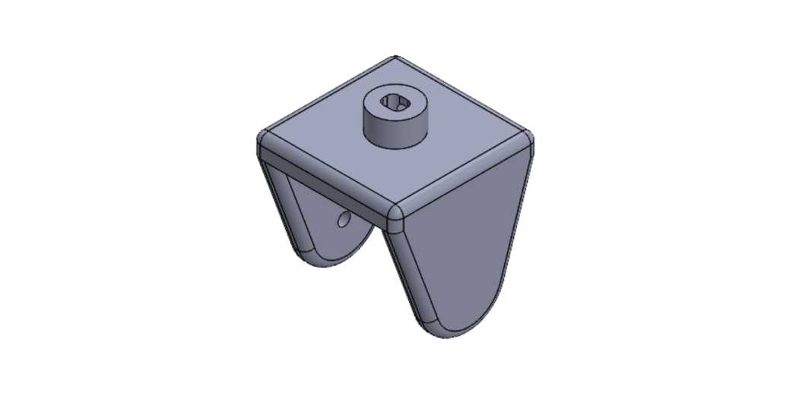
</td>
<td valign="top">

<a href="third-wheel-holder_2025-10-26_01.SLDPRT">third-wheel-holder_2025-10-26_01</a>

Bracket to hold a single wheel and attach to a motor for turning

</td>
</tr>
<!---------------------------------- Third wheel holder - with pointer-->
<tr>
<td valign="top">
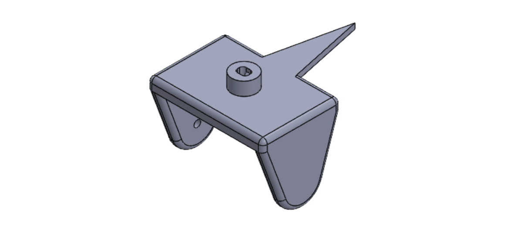
</td>
<td valign="top">

<a href="third-wheel-holder_2025-11-24_01.SLDPRT">third-wheel-holder_2025-11-24_01</a>

Bracket to hold a single wheel and attach to a motor for turning with a guider to see exactly where the wheel is aligned

</td>
</tr>
<!---------------------------------- Small spring tower -->
<tr>
<td valign="top">
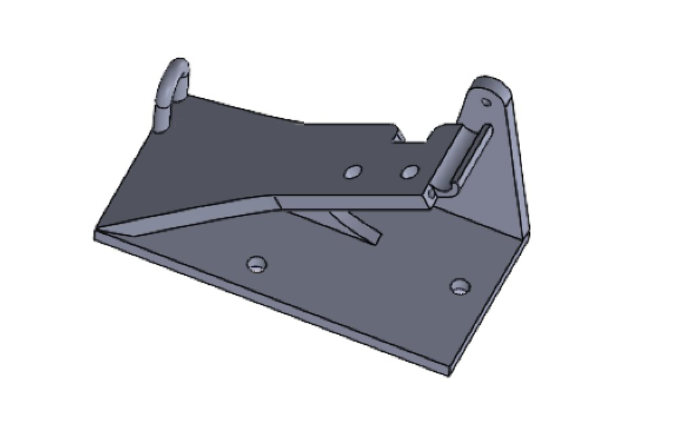
</td>
<td valign="top">

<a href="spring-tower-100_2025-11-12_02.SLDPRT">spring-tower-100_2025-11-12_02</a>

Tower to hold small spring wheel (for getting ~360 degrees from spring)

</td>
</tr>
<!---------------------------------- Small spring tower - reversed -->
<tr>
<td valign="top">
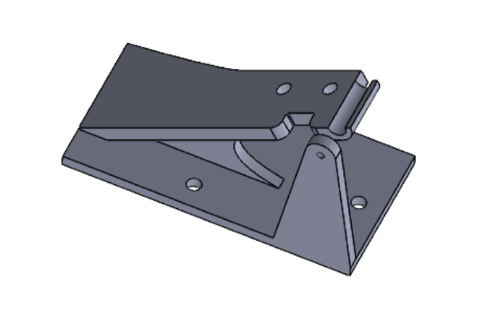
</td>
<td valign="top">

<a href="spring-tower-100-reverse_2025-11-23_01.SLDPRT">spring-tower-100-reverse_2025-11-23_01</a>

Tower to hold small spring wheel (for getting ~360 degrees from spring) - but reversed to position on the chassis backwards

</td>
</tr>
<!---------------------------------- Large spring tower -->
<tr>
<td valign="top">
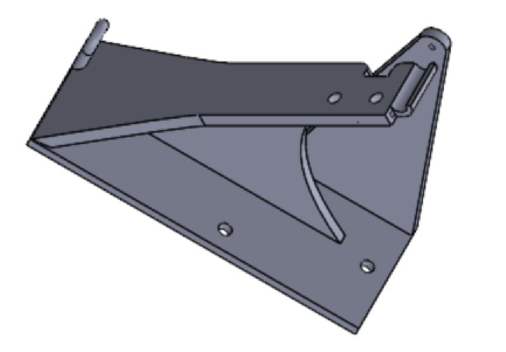
</td>
<td valign="top">

<a href="spring-tower-200_2025-11-14_01.SLDPRT">spring-tower-200_2025-11-14_01</a>

Tower to hold large spring wheel (for getting ~360 degrees from spring)

</td>
</tr>
<!---------------------------------- Spring holder top -->
<tr>
<td valign="top">

</td>
<td valign="top">

<a href="spring-holder-top_2025-11-11_01.SLDPRT">spring-holder-top_2025-11-11_01</a>

Holds the spring to the spring tower (for getting ~360 degrees from spring)

</td>
</tr>
<!---------------------------------- Spring holder top - reversed -->
<tr>
<td valign="top">
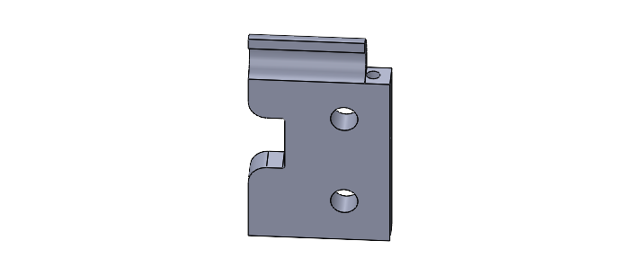
</td>
<td valign="top">

<a href="spring-holder-top-reverse_2025-11-23_01.SLDPRT">spring-holder-top-reverse_2025-11-23_01</a>

Holds the spring to the reversed spring tower (for getting ~360 degrees from spring)

</td>
</tr>
<!---------------------------------- Small spring wheel -->
<tr>
<td valign="top">
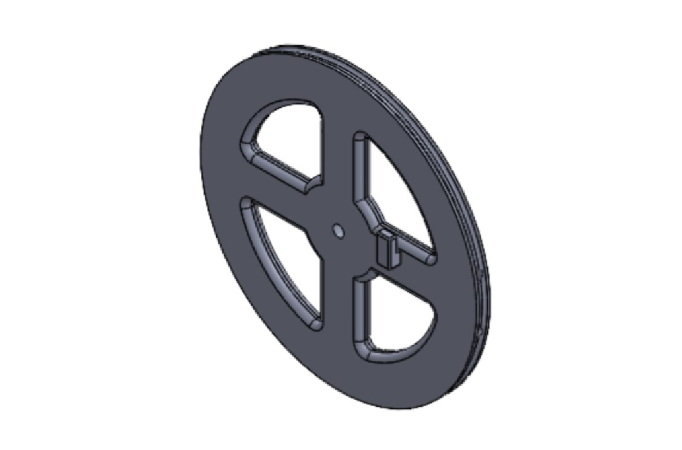
</td>
<td valign="top">

<a href="spring-wheel-100_2025-11-12_02.SLDPRT">spring-wheel-100_2025-11-12_02</a>

Small spring wheel (for getting ~360 degrees from spring)

</td>
</tr>
<!---------------------------------- Large spring wheel -->
<tr>
<td valign="top">
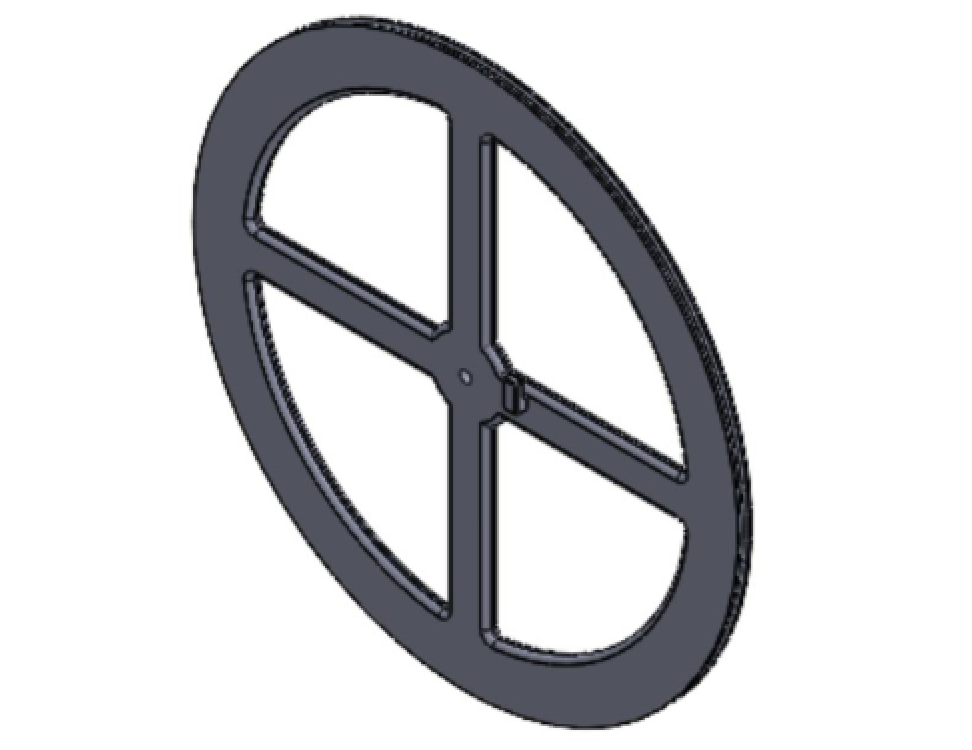
</td>
<td valign="top">

<a href="spring-wheel-200_2025-11-14_01.SLDPRT">spring-wheel-200_2025-11-14_01</a>

Large spring wheel (for getting ~360 degrees from spring)

</td>
</tr>
<!---------------------------------- Chassis -->
<tr>
<td valign="top">
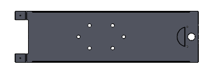
</td>
<td valign="top">

<a href="Chassis.v1-long_2025-11-24_01.SLDPRT">Chassis.v1-long_2025-11-24_01</a>

Chassis of the car

</td>
</tr>
</table>
