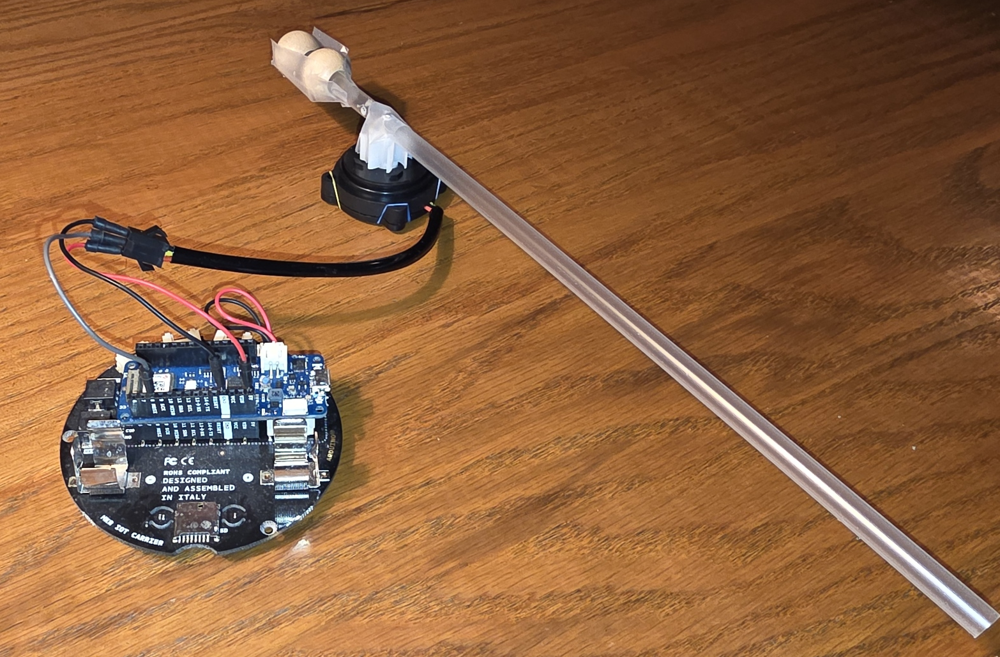
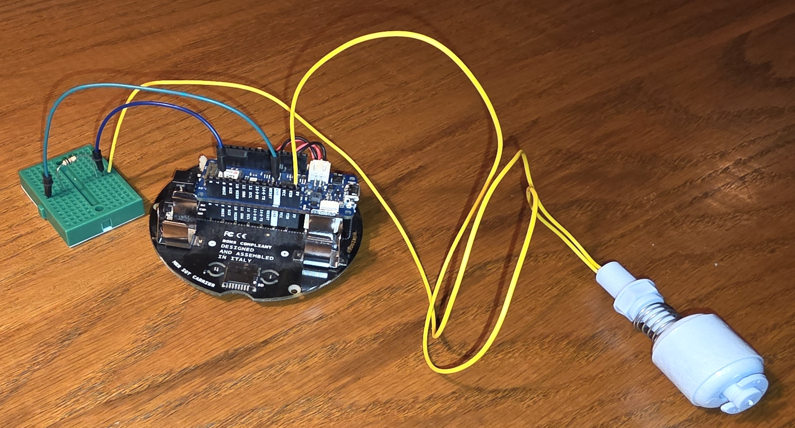
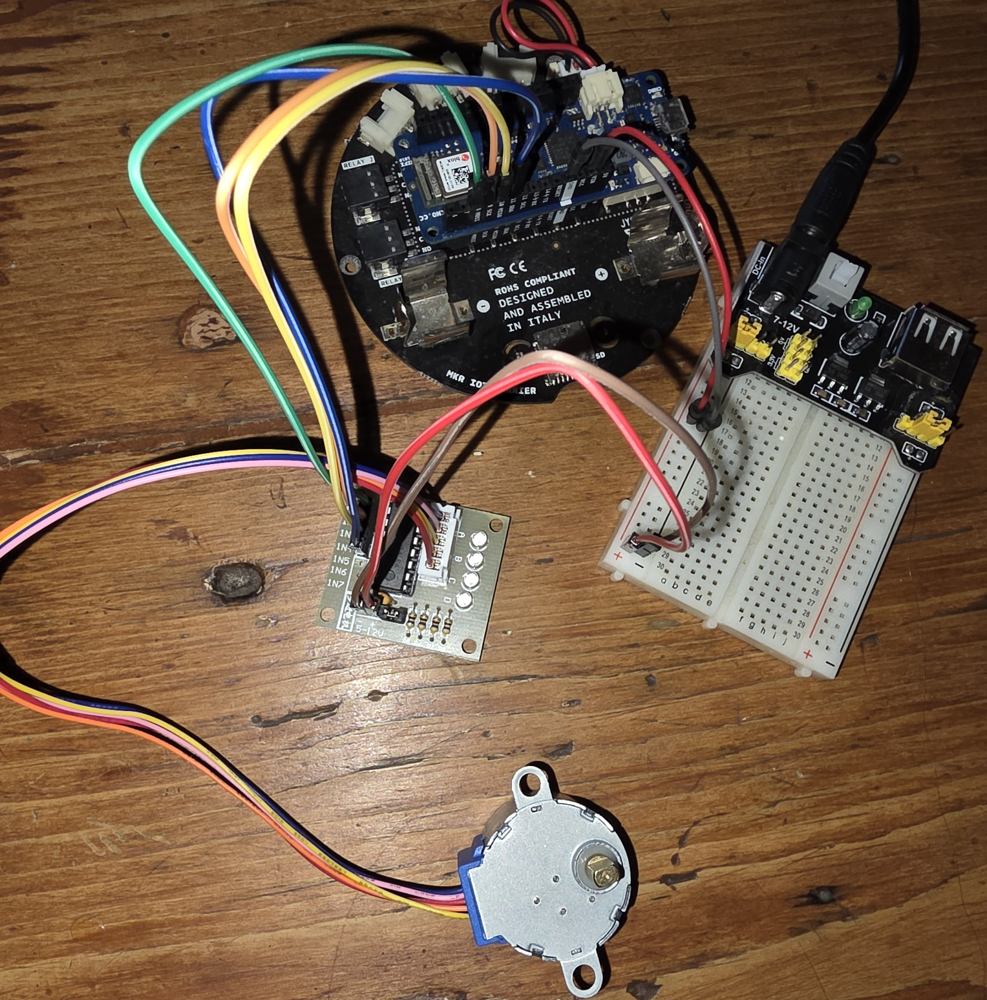

<table>
<tr><th>File</th><th>Description</th></tr>
<tr>
<td valign="top">
<a href="">Button.ino</a>
</td>
<td valign="top">
Prints status of the button to the serial monitor.  0 is pressed, 1 is unpressed.
</td>
</tr>
<tr>
<td valign="top">

<a href="flow-meter_01.ino">flow-meter_01.ino</a>

</td>
<td valign="top">

Prints status of the flow pin to the console, lights up after the sensor has been activated

<ul>
<li>Board: <a href="https://docs.arduino.cc/hardware/mkr-wifi-1010/#tech-specs">MKR WiFi 1010</a></li>
<li>Sensor: <a href="https://www.digiten.shop/products/digiten-g3-4-water-flow-hall-sensor-switch-flow-meter-1-60l-min">DIGITEN G3/4" Water Flow Hall Sensor Switch Flow Meter 1-60L/min</a></li>
<li>Inspiration: <a href="https://medium.com/@sarah-packowski/did-you-leave-the-hose-running-638365910afd">Blog post</a></li>
</ul>
</td>
</tr>
<tr>
<td valign="top">

<a href="float-meter_01.ino">float-meter_01.ino</a>

</td>
<td valign="top">

Prints status of the float sensor to the console, lights up after the sensor has been activated

<ul>
<li>Board: <a href="https://docs.arduino.cc/hardware/mkr-wifi-1010/#tech-specs">MKR WiFi 1010</a></li>
<li>Sensor: <a href="https://www.amazon.ca/dp/B07RXVPQL4?ref_=ppx_hzsearch_conn_dt_b_fed_asin_title_2">Keenso Water Level Sensor Vertical Float Switch</a></li>
<li>Inspiration: <a href="https://medium.com/@sarah-packowski/keep-water-from-overflowing-with-a-float-sensor-2c753d94a4ae">Blog post</a></li>
</ul>
</td>
</tr>
<tr>
<td valign="top">

<a href="stepper-motor_01.ino">stepper-motor_01.ino</a>

</td>
<td valign="top">

Simply spins the motor

<ul>
<li>Board: <a href="https://docs.arduino.cc/hardware/mkr-wifi-1010/#tech-specs">MKR WiFi 1010</a></li>
<li>Motor: <a href="https://www.makerguides.com/wp-content/uploads/2019/04/28byj48-Stepper-Motor-Datasheet.pdf">28BYJ-48 stepper motor</a></li>
<li>Driver board: <a href="https://www.hadex.cz/spec/m513.pdf">ULN2003 driver board</a></li>
<li>Power supply module: <a href="https://components101.com/modules/5v-mb102-breadboard-power-supply-module">MB102 Breadboard power supply module</a></li>
<li>Inspiration: <a href="https://github.com/NikodemBartnik/ArduinoTutorials/blob/master/28BYJ-48/28BYJ-48.ino">Sample by Nikodem Bartnik</a></li>
</ul>
</td>
</tr>
<tr>
<td valign="top">

<a href="stepper-motor_02.ino">stepper-motor_02.ino</a>

</td>
<td valign="top">

Everything is the same as <a href="stepper-motor_01.ino">stepper-motor_01.ino</a>, except...

This one turns the motor by a specified angle (in degrees)

</td>
</tr>
</table>

