## Features
<ul>
<li><a href="">Rear wheels</a></li>
<li><a href="">Transferring power from spring to wheels</a></li>
<li><a href="">Chassis</a></li>
<li><a href="">Detecting the object</a></li>
<li><a href="">Steering the car</a></li>
</ul>

&nbsp;

## Rear wheels

&nbsp;

## Transferring power from spring to wheels

<table>
<tr><th>Iteration</th><th>Discussion</th><th>Images</th></tr>
<tr>
<td valign="top">
1
</td>
<td valign="top">

Straight arm medium

<ul>
<li>Arm length 130cm (spring centre to string attachment)</li>
<li>Arm lashed to mousetrap hammer with wire</li>
<li>Fishing line attaches arm to axel</li>
<li>Fishing line tied to top of arm</li>
<li>Fishing line wrapped around plain wooded axel</li>
</ul>
</td>
<td valign="top">

</td>
</tr>
<tr>
<td valign="top">
2
</td>
<td valign="top">

Hammer 360

<ul>
<li>Mousetrap spring removed from the wood</li>
<li>Support structure to allow the spring to rotate as far as possible (~360°)</li>
<li>Arm lashed to the hammer</li>
</ul>
</td>
<td valign="top">

</td>
</tr>
<tr>
<td valign="top">
3
</td>
<td valign="top">

Spring tower

<ul>
<li>Mousetrap spring removed from the wood</li>
<li>3D-printed support structure to allow the spring to rotate as far as possible (~360°)</li>
</ul>
</td>
<td valign="top">

</td>
</tr>
<tr>
<td valign="top">
4
</td>
<td valign="top">

Spring wheel

<ul>
<li>Mousetrap wood and hammer removed from the spring</li>
<li>Support structure to allow the spring to rotate as far as possible (~360°)</li>
<li>Wheel is turned by the spring</li>
<li>Groove on wheel outside keeps string in place</li>
</ul>
</td>
<td valign="top">

</td>
</tr>
<tr>
<td valign="top">
4
</td>
<td valign="top">

Full drivetrain

<ul>
<li>Spring support structure and wheel mounted on chassis</li>
<li>String winds around the drive axle</li>
<li>Axle has little stick to keep the string from slipping at the end of unwinding</li>
</ul>
</td>
<td valign="top">

</td>
</tr>
</table>

&nbsp;

## Chassis

<table>
<tr><th>Iteration</th><th>Discussion</th><th>Images</th></tr>
<tr>
<td valign="top">
1
</td>
<td valign="top">

Initial

<ul>
<li>Frame of wood sticks</li>
<li>Cardboard bed</li>
<li>Chicago screws hold mousetrap</li>
<li>Eyelets hold axle</li>
</ul>
</td>
<td valign="top">
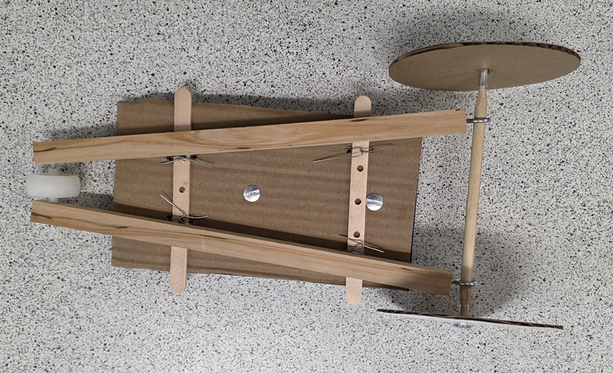
</td>
</tr>
<tr>
<td valign="top">
2
</td>
<td valign="top">

First 3D print

<ul>
<li>Wide enough for Arduino breadboards</li>
<li>Holes for stepper motor at front</li>
<li>Holes for either mousetrap or spring tower</li>
</ul>
</td>
<td valign="top">
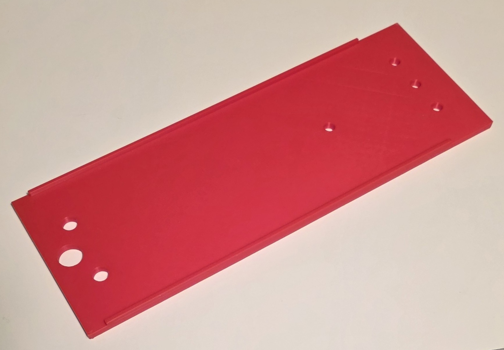
</td>
</tr>
<tr>
<td valign="top">
3
</td>
<td valign="top">

v2

<ul>
<li>New axle design</li>
</ul>
</td>
<td valign="top">
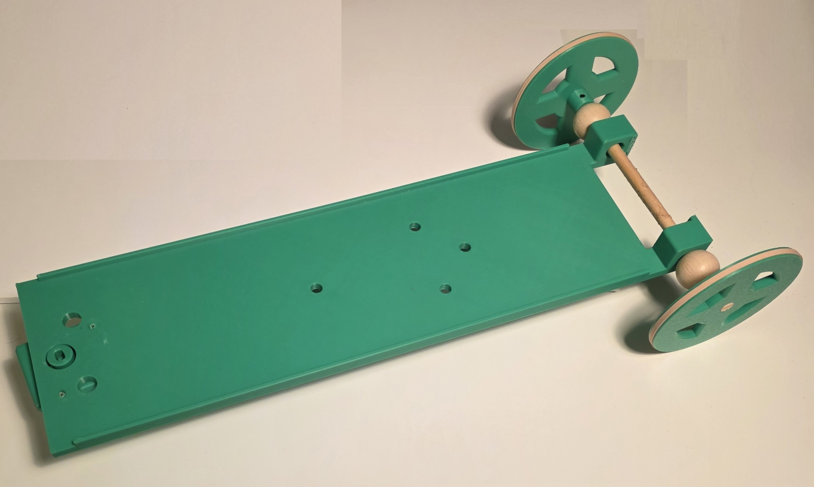
</td>
</tr>
<tr>
<td valign="top">
4
</td>
<td valign="top">

v3

<ul>
<li>Can have eyelets on top for large wheels</li>
<li>Can have eyelets on back for medium wheels</li>
<li>Can have eyelets on bottom for small wheels</li>
</ul>
</td>
<td valign="top">
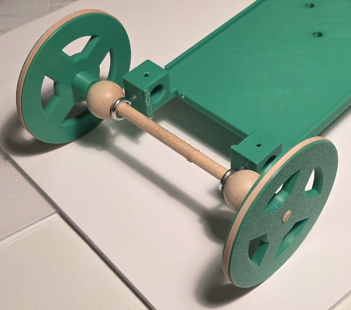
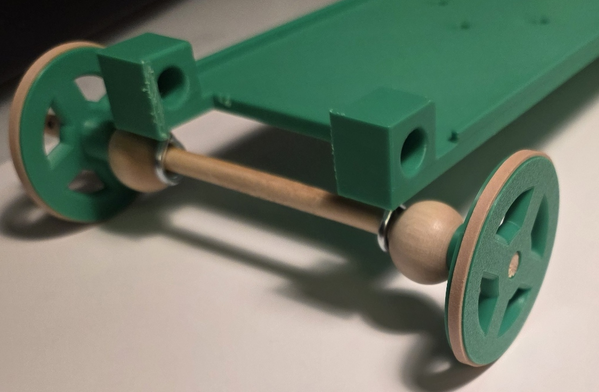
</td>
</tr>
<tr>
<td valign="top">
5
</td>
<td valign="top">

With protractor

<ul>
<li>Holds protractor at front</li>
<li>Can hold a mousetrap, or it can hold a spring tower facing forward or backward</li>
</ul>
</td>
<td valign="top">
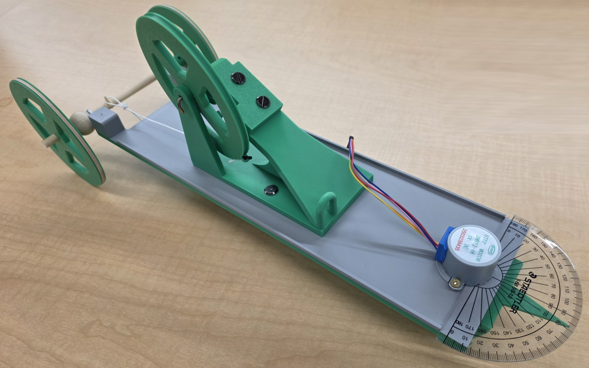
</td>
</tr>
<tr>
<td valign="top">
6
</td>
<td valign="top">

With sight wire

<ul>
<li>Vertical wire at back of chassis can be aligned with the pointer on the front wheel to precisely  aim where the car is going</li>
</ul>
</td>
<td valign="top">

</td>
</tr>
</table>

&nbsp;

## Detecting the object

&nbsp;

## Steering the car

<table>
<tr><th>Iteration</th><th>Discussion</th><th>Images</th></tr>
<tr>
<td valign="top">
1
</td>
<td valign="top">

No turn

<ul>
<li>Single wheel</li>
<li>Axle fixed to chassis</li>
</ul>
</td>
<td valign="top">
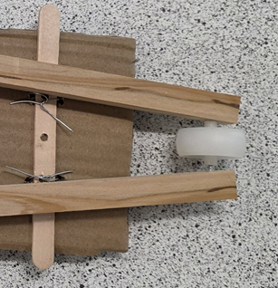
</td>
</tr>
<tr>
<td valign="top">
2
</td>
<td valign="top">

Swivel

<ul>
<li>Single wheel</li>
<li>Axle fixed to swivel</li>
<li>Hole at top of swivel to attach to a motor</li>
</ul>
</td>
<td valign="top">
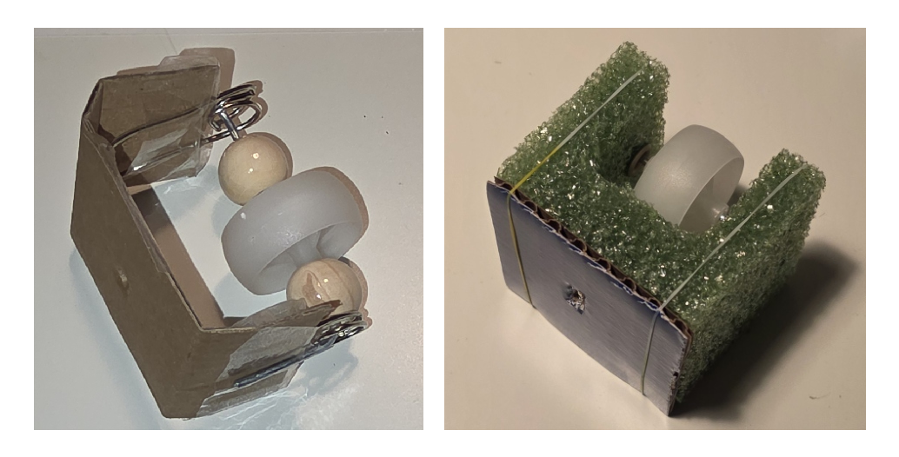
</td>
</tr>
<tr>
<td valign="top">
3
</td>
<td valign="top">

Flange-inspired

<ul>
<li>Single wheel</li>
<li>Axle fixed to swivel</li>
<li>Flange type attachement at top to attach to a motor</li>
</ul>
</td>
<td valign="top">
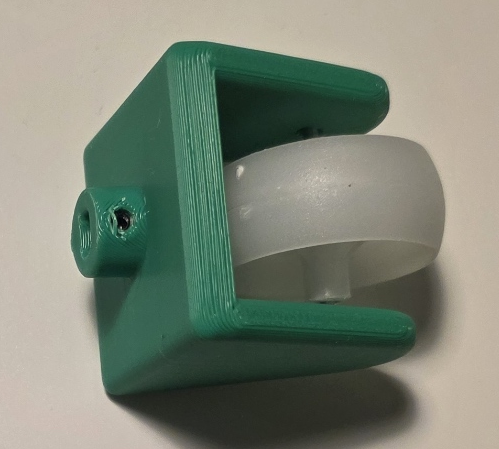
</td>
</tr>
<tr>
<td valign="top">
4
</td>
<td valign="top">

Wheel pointer

<ul>
<li>Pointer is added to the swivel to show the direction the wheel is facing</li>
<li>Swivel is wider to allow more wheel extension to cover a longer axle (for less wiggle)</li>
</ul>
</td>
<td valign="top">
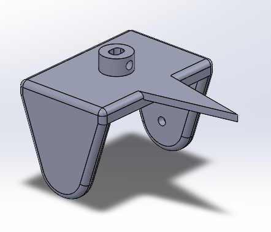
</td>
</tr>
<tr>
<td valign="top">
5
</td>
<td valign="top">

Protractor

<ul>
<li>Wheel is attached to stepper moter on chassis</li>
<li>Protractor is attached to chassis, centered on stepper motor arm</li>
<li>Angle of wheel turn can be read by the angle to which the wheel pointer aligns on the protractor</li>
</ul>
</td>
<td valign="top">
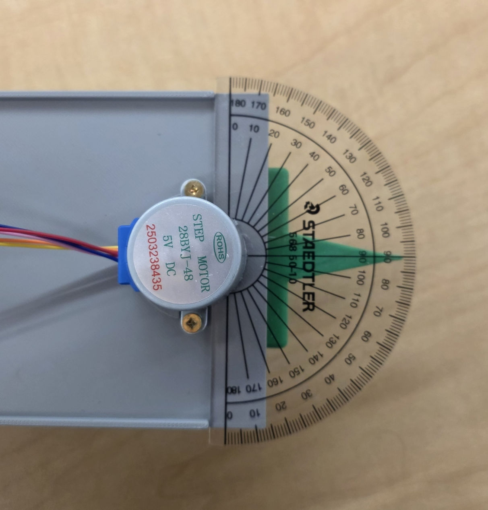
</td>
</tr>
</table>

&nbsp;

