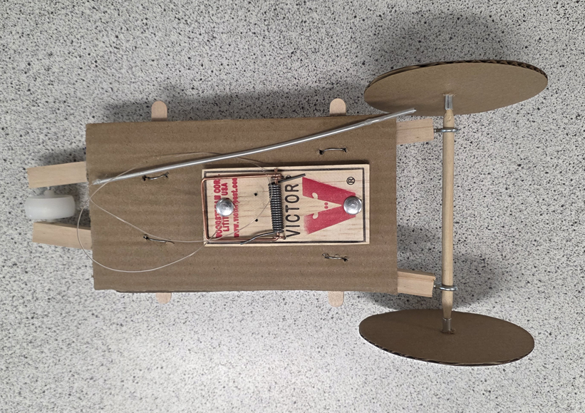
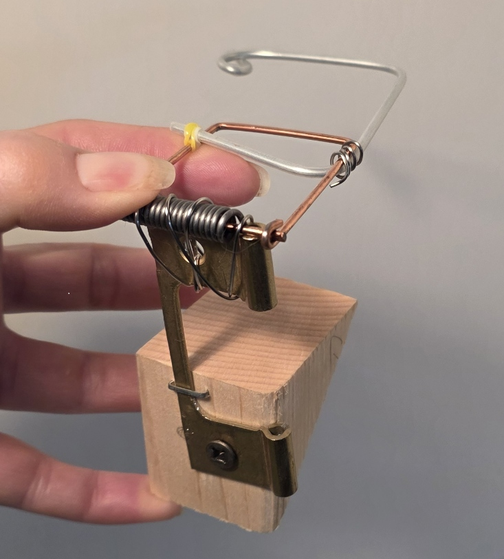
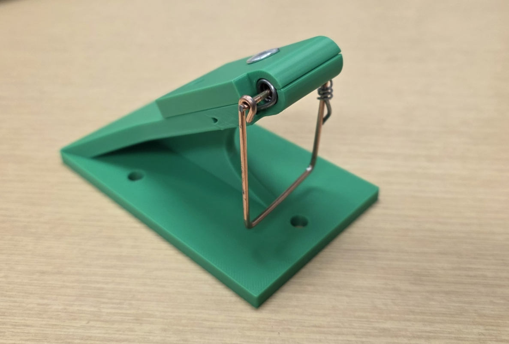
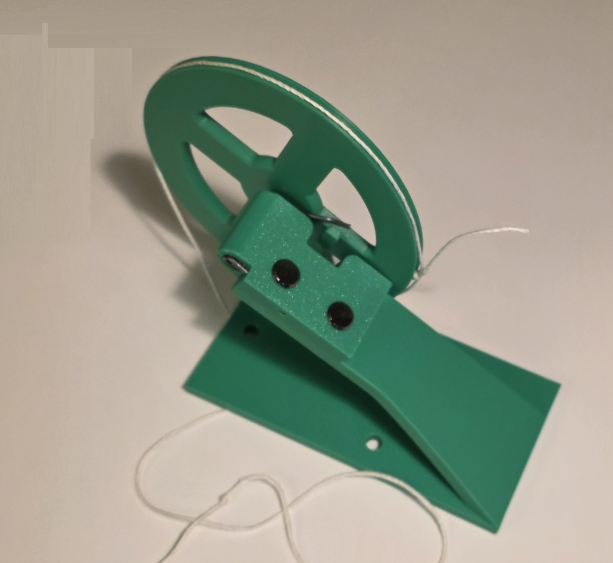
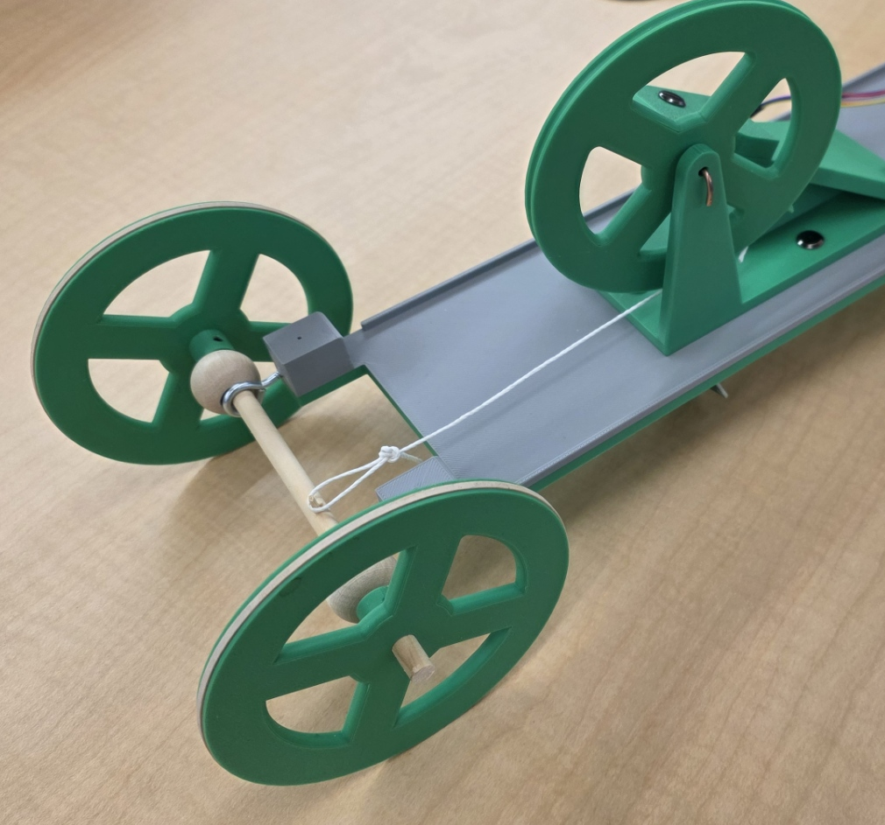

## Features
<ul>
<li><a href="">Rear wheels</a></li>
<li><a href="">Transferring power from spring to wheels</a></li>
<li><a href="">Detecting the object</a></li>
<li><a href="">Steering the car</a></li>
</ul>

&nbsp;

## Rear wheels

&nbsp;

## Transferring power from spring to wheels

<table>
<tr><th>Iteration</th><th>Discussion</th><th>Images</th></tr>
<tr>
<td valign="top">
1
</td>
<td valign="top">

Straight arm medium

<ul>
<li>Arm length 130cm (spring centre to string attachment)</li>
<li>Arm lashed to mousetrap hammer with wire</li>
<li>Fishing line attaches arm to axel</li>
<li>Fishing line tied to top of arm</li>
<li>Fishing line wrapped around plain wooded axel</li>
</ul>
</td>
<td valign="top">

</td>
</tr>
<tr>
<td valign="top">
2
</td>
<td valign="top">

Hammer 360

<ul>
<li>Mousetrap spring removed from the wood</li>
<li>Support structure to allow the spring to rotate as far as possible (~360°)</li>
<li>Arm lashed to the hammer</li>
</ul>
</td>
<td valign="top">

</td>
</tr>
<tr>
<td valign="top">
3
</td>
<td valign="top">

Spring tower

<ul>
<li>Mousetrap spring removed from the wood</li>
<li>3D-printed support structure to allow the spring to rotate as far as possible (~360°)</li>
</ul>
</td>
<td valign="top">

</td>
</tr>
<tr>
<td valign="top">
4
</td>
<td valign="top">

Spring wheel

<ul>
<li>Mousetrap wood and hammer removed from the spring</li>
<li>Support structure to allow the spring to rotate as far as possible (~360°)</li>
<li>Wheel is turned by the spring</li>
<li>Groove on wheel outside keeps string in place</li>
</ul>
</td>
<td valign="top">

</td>
</tr>
<tr>
<td valign="top">
4
</td>
<td valign="top">

Full drivetrain

<ul>
<li>Spring support structure and wheel mounted on chassis</li>
<li>String winds around the drive axle</li>
<li>Axle has little stick to keep the string from slipping at the end of unwinding</li>
</ul>
</td>
<td valign="top">

</td>
</tr>
</table>

&nbsp;

## Detecting the object

&nbsp;

## Steering the car

&nbsp;

