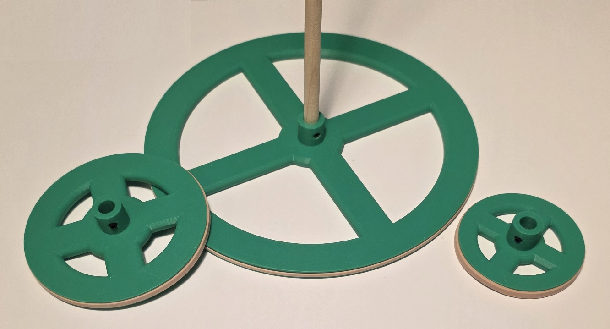

# Parts

<ul>
<li><a href="#drive-wheel">Drive wheel</a></li>
<li><a href="">Axle</a></li>
<li><a href="">Chassis</a></li>
<li><a href="">Spring tower</a></li>
<li><a href="">Turning wheel</a></li>
<li><a href="">...</a></li>
<li><a href="">...</a></li>
<li><a href="">...</a></li>
</ul>

### Drive wheel
<table>
<tr>
<td valign="top"><b>Part description</b></td><td valign="top">

bla bla bla

</td>
</tr>
<tr>
<td valign="top"><b>Designer</b></td>
<td valign="top">&nbsp;</td>
</tr>
<tr>
<td valign="top"><b>Approver</b></td>
<td valign="top">&nbsp;</td>
</tr>
<tr>
<td valign="top"><b>Part number issued</b></td>
<td valign="top">ALGO_#####</td>
</tr>
<tr>
<td valign="top"><b>Revision</b></td>
<td valign="top">&nbsp;</td>
</tr>
</table>

